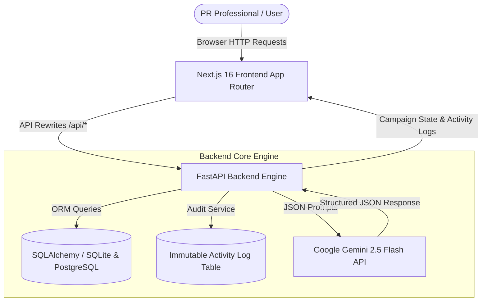

# 📡 PR Campaign Desk

> **Enterprise Campaign Operations Workspace for Modern PR Agencies**

PR Campaign Desk is a full-stack, monorepo application engineered to streamline media relations, campaign stage tracking, audit logging, and AI-assisted pitching for public relations teams.

---

## 🛠️ Technology Stack

| Layer | Technologies & Tools | Key Features |
| :--- | :--- | :--- |
| **Frontend UI** | **Next.js 16 (App Router)**, **TypeScript**, **Tailwind CSS** | Premium Glassmorphism Dark Mode, Dual Views (Table & Status Grouping), Interactive Workflow Steppers |
| **Backend API** | **FastAPI**, **Python 3.12**, **Pydantic v2** | High-performance async REST API, auto-generated OpenAPI / Swagger docs |
| **AI Copilot** | **Google Gemini 2.5 Flash API** (`google-genai`) | Free-tier compatible, structured JSON mode, Human-in-the-Loop advisory guardrails |
| **Database & ORM** | **SQLAlchemy 2.0**, **SQLite** / **PostgreSQL** | Database-agnostic ORM, automated table initialization, `psycopg2-binary` cloud database ready |
| **Testing** | **Pytest**, **Starlette TestClient** | 100% test coverage across campaign CRUD operations, audit logging, and AI fallback rules |
| **Deployment** | **Vercel Multi-Service Runtime** (`vercel.json`) | Monorepo deployment routing Next.js static pages and FastAPI serverless functions on a single domain |

---

## 🎯 The Problem & The Solution

### The PR Agency Problem
1. **Fragmented Workflows**: PR teams rely on scattered spreadsheets, email threads, and messaging apps to track pitching progress, leading to missed deadlines and client confusion.
2. **Lack of Auditability**: Pitch modifications, client approvals, and media outreach status changes happen without recorded history or accountability.
3. **Risks of Unchecked AI**: Autonomous AI tools risk hallucinating real reporter names, inventing fake email addresses, or making unapproved status changes.

### The PR Campaign Desk Solution
- **8-Stage Structured Workflow**: Every story moves through strict, sequential PR lifecycle stages from initial concept (`NEW`) to final media publication (`COMPLETED`).
- **Immutable Audit Trail**: Automatic activity logging tracks every stage transition, field update, and timestamp.
- **Human-in-the-Loop AI Assistant**: Powered by **Google Gemini 2.5 Flash**, the AI acts purely as an advisory copilot. Suggestions must be manually reviewed and approved by a human PR professional before applying to campaign records.

---

## 🏗️ System Architecture



---

## 🔄 8-Stage PR Campaign Workflow

Every campaign progresses through 8 defined operational stages:

| Stage # | Stage Key | Color Indicator | Operational Description |
| :---: | :--- | :---: | :--- |
| **1** | `NEW` | 🔵 Slate | Campaign pitch created; initial story angle defined. |
| **2** | `STORY_DEVELOPMENT` | 🟣 Indigo | Angle refinement, executive quote gathering, and research. |
| **3** | `ARTICLE_DRAFT` | 🟤 Amber | Drafting press release, media pitch, or executive byline. |
| **4** | `CLIENT_REVIEW` | 🟠 Orange | Pitch shared with client stakeholders for sign-off. |
| **5** | `APPROVED` | 🟢 Emerald | Client approval secured; media list finalized. |
| **6** | `MEDIA_OUTREACH` | 🔵 Blue | Story pitched to target journalists and media outlets. |
| **7** | `PUBLISHED` | 🟣 Purple | Media coverage secured; story published by outlet. |
| **8** | `COMPLETED` | 🟢 Teal | Coverage report delivered; campaign archived. |

---

## 🤖 Human-in-the-Loop AI & Guardrail Framework

PR Campaign Desk integrates **Google Gemini 2.5 Flash API** to provide three specialized AI assistant tools:

1. **✨ Campaign Summarizer**: Synthesizes story summaries and notes into a 2-sentence summary and 3 key talking points.
2. **🎯 Next Action Recommender**: Recommends the optimal next strategic step based on the campaign's current stage and target publication.
3. **✉️ Media Pitch Email Drafter**: Drafts tailored journalist pitches with customizable tone controls (*Professional*, *Urgent News Hook*, *Friendly & Concise*, *Exclusive Embargo*).

### Strict AI Safety Guardrails
- **Zero Direct Database Writes**: AI outputs are strictly rendered in a slide-over preview panel. The user must click **"Apply"** to update campaign records.
- **Anti-Hallucination Prompting**: System instructions explicitly forbid generating real or fake journalist names, forcing placeholders such as `[Editor Name]` or `[Target Reporter]`.
- **Graceful Error Handling**: If `GEMINI_API_KEY` is missing or API limits are reached, the system returns an HTTP 503 response and displays a helpful UI alert without interrupting core campaign operations.

---

## 📂 Repository Structure

```
PR-Campaign-Desk/
├── backend/                  # FastAPI Python Backend
│   ├── app/
│   │   ├── main.py           # FastAPI entrypoint & CORS middleware
│   │   ├── config.py         # Settings & environment variables
│   │   ├── database.py       # SQLAlchemy engine & session maker
│   │   ├── models.py         # DB models (Campaign, ActivityLog)
│   │   ├── schemas.py        # Pydantic validation schemas
│   │   ├── routers/          # API route handlers
│   │   └── services/         # Business logic & Google Gemini AI service
│   ├── tests/                # Automated pytest suite (13 tests)
│   ├── seed.py               # Database seeder (8 default campaigns)
│   └── requirements.txt      # Python dependencies
│
├── frontend/                 # Next.js 16 TypeScript Frontend
│   ├── src/
│   │   ├── app/              # Next.js App Router (Dashboard & Detail Pages)
│   │   ├── components/       # UI components (Steppers, Tables, AI Drawer)
│   │   └── lib/              # Types & API client functions
│   ├── next.config.ts        # Next.js config & local API dev proxy rewrites
│   └── package.json          # Node dependencies
│
├── vercel.json               # Vercel multi-service monorepo configuration
├── .env.example              # Environment variable template
└── README.md                 # Project documentation
```

---

## 🚀 Quick Start & Local Setup

### Prerequisites
- **Python 3.12+**
- **Node.js 18+** & `npm`
- Free Google Gemini API Key from **[Google AI Studio](https://aistudio.google.com/app/apikey)**

### 1. Clone & Setup Environment
```bash
git clone https://github.com/yusufmusharrafm/PR-Campaign-Desk.git
cd PR-Campaign-Desk

# Create .env file
cp .env.example .env
```

Add your free Gemini API key to `.env`:
```env
DATABASE_URL=sqlite:///./pr_campaign_desk.db
GEMINI_API_KEY=AIzaSyYourFreeGeminiKeyHere
```

### 2. Run Backend Server
```bash
cd backend
python3 -m venv .venv
source .venv/bin/activate
pip install -r requirements.txt

# Seed sample data
python seed.py

# Start FastAPI server
uvicorn app.main:app --host 127.0.0.1 --port 8000
```
*Backend runs on `http://127.0.0.1:8000` (API Docs: `http://127.0.0.1:8000/docs`)*

### 3. Run Frontend App
In a new terminal window:
```bash
cd frontend
npm install
npm run dev -- --port 3000
```
*Frontend runs on `http://localhost:3000`*

---

## 🧪 Automated Testing

Run the backend test suite:
```bash
cd backend
.venv/bin/pytest tests
```
*Executes 13 automated tests covering models, campaign CRUD endpoints, audit log generation, and Gemini AI error handling.*

---

## 🌐 Production Deployment (Vercel)

PR Campaign Desk is pre-configured for **Vercel Multi-Service Deployment** via `vercel.json`:

1. Import the repository into your Vercel account.
2. Select the **PR-Campaign-Desk** framework preset.
3. Configure Environment Variables in Vercel:
   - `GEMINI_API_KEY`: Your Google Gemini API Key.
   - `DATABASE_URL`: (Optional) PostgreSQL connection string (e.g. Supabase or Neon). If omitted, falls back to SQLite in `/tmp`.

---

## 📜 License & Acknowledgments

Built for modern PR campaign operations. Powered by Next.js, FastAPI, and Google Gemini API.
